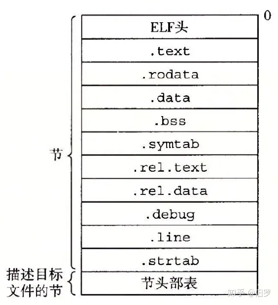
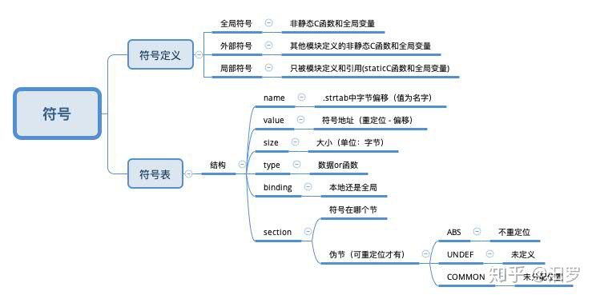

# elf文件格式
## 1 简介
什么是ELF
系统里的目标文件是按照特定的目标文件格式来组织的，各个系统的目标文件格式都不相同。

从贝尔实验室诞生的第一个Unix系统使用的是a.out格式（直到今天，可执行文件仍然称为a.out文件）。Windows使用可移植可执行（PortableExecutable，PE)格式。Mac OS-X使用Mach-O格式。现代x86-64Linux和Unix系统使用可执行可链接格式（Executable and Linkable Format，ELF)。

ELF格式的文件在Linux系统下有.axf、 .bin、 .elf、 .o、 .prx、 .puff、 .ko、 .mod和.so等等

1) 分类

可重定位文件(Relocatable File) .o)包含适合于与其他目标文件链接来创建可执行文件或者共享目标文件的代码和数据。


可执行文件(Executable File) .exe) 包含适合于执行的一个程序，此文件规定了exec() 如何创建一个程序的进程映像。


共享目标文件(Shared Object File) .so) 包含可在两种上下文中链接的代码和数据。


首先链接编辑器可以将它和其它可重定位文件和共享目标文件一起处理， 生成另外一个目标文件。

其次动态链接器(Dynamic Linker)可能将它与某 个可执行文件以及其它共享目标一起组合，创建进程映像。

2) 作用

ELF文件参与程序的连接(建立一个程序)和程序的执行(运行一个程序)，所以可以从不同的角度来看待elf格式的文件：


如果用于编译和链接（可重定位文件），则编译器和链接器将把elf文件看作是节头表描述的节的集合,程序头表可选。


如果用于加载执行（可执行文件），则加载器则将把elf文件看作是程序头表描述的段的集合，一个段可能包含多个节，节头表可选。


如果是共享文件，则两者都含有。

3) ELF文件总体组成：

elf文件头描述elf文件的总体信息。包括：

系统相关，类型相关，加载相关，链接相关。

系统相关表示：elf文件标识的魔术数，以及硬件和平台等相关信息，增加了elf文件的移植性,使交叉编译成为可能。

类型相关就是前面说的那个类型。

加载相关：包括程序头表相关信息。

链接相关：节头表相关信息。

下面对其进行了详细的介绍。

## 2 ELF文件格式
### 典型格式
典型的ELF可重定位目标文件的格式如下图：

其中： - .text 节里装载了程序的可执行机器码 - .rodata 节里装载了只读数据 - .data 节里面装载了被初始化的数据，包括全局和静态C变量 - .bss 节里面装载了未被初始化的全局和静态C变量(在目标文件中只是占位符，不占空间) - .symtab 或者 .dynsym 节里面装载了符号信息 - 以 .rel 打头的 节里面装载了重定位条目 - .debug 一个调试符号表，只有使用了-g参数编译时才会有，用于debug - .line 用于记录C源程序的行号和.text节中机器指令之间的映射，也是只有使用了-g参数编译时才会有 - .strtab 或者 .dynstr 节里面装载了字符串信息（以null结尾的字符串信息）

### 1. ELF文件的组织

ELF文件参与程序的连接(建立一个程序)和程序的执行(运行一个程序)，编译器和链接器将其视为节头表(section header table)描述的一些节(section)的集合，而加载器则将其视为程序头表(program header table)描述的段(segment)的集合，通常一个段可以包含多个节。可重定位文件都包含一个节头表，可执行文件都包含一个程序头表。共享文件两者都包含有。为此，ELF文件格式同时提供了两种看待文件内容的方式，反映了不同行为的不同要求。

从链接的角度看，ELF文件从开始到结束，可以看成是如下组成的：

a)ELF文件头

b)程序头表（可选）

c)第1节,第2节，...，第n节，...

d)节头表

从执行的角度看，ELF文件从开始到结束，可以看成是如下组成的：

a)ELF文件头

b)程序头表

c)第1段,第2段，...，

d)节头表(可选)


### 2. 文件头(Elf header)

Elf头在程序的开始部位，作为引路表描述整个ELF的文件结构，其信息大致分为四部分：一是系统相关信息，二是目标文件类型，三是加载相关信息，四是链接相关信息。

其中系统相关信息包括elf文件魔数(标识elf文件)，平台位数，数据编码方式，elf头部版本，硬件平台e_machine，目标文件版本 e_version，处理器特定标志e_ftags：这些信息的引入极大增强了elf文件的可移植性，使交叉编译成为可能。目标文件类型用e_type的值表示，可重定位文件为1，可执行文件为2，共享文件为3;加载相关信息有：程序进入点e_entry．程序头表偏移量e_phoff，elf头部长度 e_ehsize，程序头表中一个条目的长度e_phentsize，程序头表条目数目e_phnum;链接相关信息有：节头表偏移量e_shoff，节头表中一个条目的长度e_shentsize，节头表条目个数e_shnum ，节头表字符索引e shstmdx。可使用命令"readelf -h filename"来察看文件头的内容。

文件头的数据结构如下：
```
typedef struct elf32_hdr{

unsigned char e_ident[EI_NIDENT];

Elf32_Half e_type;//目标文件类型

Elf32_Half e_machine;//硬件平台

Elf32_Word e_version;//elf头部版本

Elf32_Addr e_entry;//程序进入点

Elf32_Off e_phoff;//程序头表偏移量

Elf32_Off e_shoff;//节头表偏移量

Elf32_Word e_flags;/处理器特定标志

Elf32_Half e_ehsize;//elf头部长度

Elf32_Half e_phentsize;//程序头表中一个条目的长度

Elf32_Half e_phnum;//程序头表条目数目

Elf32_Half e_shentsize;//节头表中一个条目的长度

Elf32_Half e_shnum;//节头表条目个数

Elf32_Half e_shstrmdx;//节头表字符索引

}Elf32_Ehdr;
```


### 3. 程序头表(program header table)

程序头表告诉系统如何建立一个进程映像．它是从加载执行的角度来看待elf文件．从它的角度看．elf文件被分成许多段，elf文件中的代码、链接信息和注释都以段的形式存放。每个段都在程序头表中有一个表项描述，包含以下属性：段的类型，段的驻留位置相对于文件开始处的偏移，段在内存中的首字节地址，段的物理地址，段在文件映像中的字节数．段在内存映像中的字节数，段在内存和文件中的对齐标记。可用"readelf -l filename"察看程序头表中的内容。程序头表的结构如下：
```
typedef struct elf32_phdr{

Elf32_Word p_type; //段的类型

Elf32_Off p_offset; //段的位置相对于文件开始处的偏移

Elf32_Addr p_vaddr; //段在内存中的首字节地址

Elf32_Addr p_paddr;//段的物理地址

Elf32_Word p_filesz;//段在文件映像中的字节数

Elf32_Word p_memsz;//段在内存映像中的字节数

Elf32_Word p_flags;//段的标记

Elf32_Word p_align;，/段在内存中的对齐标记

)Elf32_Phdr;

```

### 4. 节头表(section header table)

节头表描述程序节，为编译器和链接器服务。它把elf文件分成了许多节．每个节保存着用于不同目的的数据．这些数据可能被前面的程序头重复使用，完成一次任务所需的信息往往被分散到不同的节里。由于节中数据的用途不同，节被分成不同的类型，每种类型的节都有自己组织数据的方式。每一个节在节头表中都有一个表项描述该节的属性，节的属性包括小节名在字符表中的索引，类型，属性，运行时的虚拟地址，文件偏移，以字节为单位的大小，小节的对齐等信息，可使用"readelf -S filename"来察看节头表的内容。节头表的结构如下：
```
typedef struct{

Elf32_Word sh_name;//小节名在字符表中的索引

E1t32_Word sh_type;//小节的类型

Elf32_Word sh_flags;//小节属性

Elf32_Addr sh_addr; //小节在运行时的虚拟地址

Elf32_Off sh_offset;//小节的文件偏移

Elf32_Word sh_size;//小节的大小．以字节为单位

Elf32_Word sh_link;//链接的另外一小节的索引

Elf32 Word sh_info;//附加的小节信息

Elf32 Word sh_addralign;//小节的对齐

Elf32 Word sh_entsize; //一些sections保存着一张固定大小入口的表。就像符号表

}Elf32_Shdr;
```

### 5. 符号表部分解析
符号表每节定义如下：
```
typedef struct {
    int   name;      /* String table offset */
    char  type:4,    /* Function or data (4 bits) */
      binding:4; /* Local or global (4 bits) */
    char  reserved;  /* Unused */  
    short section;   /* Section header index */
    long  value;     /* Section offset or absolute address */
    long  size;      /* Object size in bytes */
} Elf64_Symbol;
```
具体解释如下：



举个例子
以上面的sum.c生成的sum.o为例，我们选取readelf的-all参数输出全部内容：
```
$readelf -all sum.o
ELF Header:
  Magic:   7f 45 4c 46 02 01 01 00 00 00 00 00 00 00 00 00
  Class:                             ELF64
  Data:                              2's complement, little endian
  Version:                           1 (current)
  OS/ABI:                            UNIX - System V
  ABI Version:                       0
  Type:                              REL (Relocatable file)
  Machine:                           Advanced Micro Devices X86-64
  Version:                           0x1
  Entry point address:               0x0
  Start of program headers:          0 (bytes into file)
  Start of section headers:          536 (bytes into file)
  Flags:                             0x0
  Size of this header:               64 (bytes)
  Size of program headers:           0 (bytes)
  Number of program headers:         0
  Size of section headers:           64 (bytes)
  Number of section headers:         11
  Section header string table index: 10

Section Headers:
  [Nr] Name              Type             Address           Offset
       Size              EntSize          Flags  Link  Info  Align
  [ 0]                   NULL             0000000000000000  00000000
       0000000000000000  0000000000000000           0     0     0
  [ 1] .text             PROGBITS         0000000000000000  00000040
       000000000000001b  0000000000000000  AX       0     0     1
  [ 2] .data             PROGBITS         0000000000000000  0000005b
       0000000000000000  0000000000000000  WA       0     0     1
  [ 3] .bss              NOBITS           0000000000000000  0000005b
       0000000000000000  0000000000000000  WA       0     0     1
  1 int sum(int *a, int n)
  2 {
  [ 4] .comment          PROGBITS         0000000000000000  0000005b
       000000000000002e  0000000000000001  MS       0     0     1
  [ 5] .note.GNU-stack   PROGBITS         0000000000000000  00000089
       0000000000000000  0000000000000000           0     0     1
  [ 6] .eh_frame         PROGBITS         0000000000000000  00000090
       0000000000000030  0000000000000000   A       0     0     8
  [ 7] .rela.eh_frame    RELA             0000000000000000  000001a8
       0000000000000018  0000000000000018   I       8     6     8
  [ 8] .symtab           SYMTAB           0000000000000000  000000c0
       00000000000000d8  0000000000000018           9     8     8
  [ 9] .strtab           STRTAB           0000000000000000  00000198
       000000000000000b  0000000000000000           0     0     1
  [10] .shstrtab         STRTAB           0000000000000000  000001c0
       0000000000000054  0000000000000000           0     0     1
Key to Flags:
  W (write), A (alloc), X (execute), M (merge), S (strings), I (info),
  L (link order), O (extra OS processing required), G (group), T (TLS),
  C (compressed), x (unknown), o (OS specific), E (exclude),
  l (large), p (processor specific)

There are no section groups in this file.

There are no program headers in this file.

Relocation section '.rela.eh_frame' at offset 0x1a8 contains 1 entries:
  Offset          Info           Type           Sym. Value    Sym. Name + Addend
000000000020  000200000002 R_X86_64_PC32     0000000000000000 .text + 0

The decoding of unwind sections for machine type Advanced Micro Devices X86-64 is not currently supported.

Symbol table '.symtab' contains 9 entries:
   Num:    Value          Size Type    Bind   Vis      Ndx Name
     0: 0000000000000000     0 NOTYPE  LOCAL  DEFAULT  UND
     1: 0000000000000000     0 FILE    LOCAL  DEFAULT  ABS sum.i
     2: 0000000000000000     0 SECTION LOCAL  DEFAULT    1
     3: 0000000000000000     0 SECTION LOCAL  DEFAULT    2
     4: 0000000000000000     0 SECTION LOCAL  DEFAULT    3
     5: 0000000000000000     0 SECTION LOCAL  DEFAULT    5
     6: 0000000000000000     0 SECTION LOCAL  DEFAULT    6
     7: 0000000000000000     0 SECTION LOCAL  DEFAULT    4
     8: 0000000000000000    27 FUNC    GLOBAL DEFAULT    1 sum

No version information found in this file.
```
其中第一部分是ELF头（ELF header）中的描述信息。（用-h参数可以单独得到）。

最后一部分是符号表部分（用-s参数可以单独得到该部分），前面八个条目是链接器内部使用的局部符号，最后一行是全局符号sum定义的条目。可以通过最后一行看出，它是一个位于.text节中偏移量为0处的27字节函数。（Ndx部分表示在哪个节中，1表示.text节，3表示.data节，对应上面输出的Section Headers部分）

### 6. 节与静态链接
常规的 ELF 文件，ET_REL, ET_DYN 以及 ET_EXEC 类型都含有节，对于 ET_REL 类型 的ELF文件，节是必须存在的，而对于 ET_DYN 和 ET_EXEC 是可以没有节的，但由于Linux系统的版本碎片化比较严重，可执行文件也可能要求含有节，否则无法执行（如安卓后期版本的系统），这依赖于系统动态链接器的实现。

ET_REL 类型的 ELF，节中包含了一些符号定义、节属性（可读可写可执行）。通过 readelf 工具可以方便查看这些信息：
```
$readelf test.o -S
There are 15 section headers, starting at offset 0x2e0:

Section Headers:
  [Nr] Name              Type            Addr     Off    Size   ES Flg Lk Inf Al
  [ 0]                   NULL            00000000 000000 000000 00      0   0  0
  [ 1] .group            GROUP           00000000 000034 000008 04     12  12  4
  [ 2] .text             PROGBITS        00000000 00003c 000032 00  AX  0   0  1
  [ 3] .rel.text         REL             00000000 00022c 000020 08   I 12   2  4
  [ 4] .data             PROGBITS        00000000 00006e 000000 00  WA  0   0  1
  [ 5] .bss              NOBITS          00000000 00006e 000000 00  WA  0   0  1
  [ 6] .rodata           PROGBITS        00000000 00006e 00000b 00   A  0   0  1
  [ 7] .text.__x86.get_p PROGBITS        00000000 000079 000004 00 AXG  0   0  1
  [ 8] .comment          PROGBITS        00000000 00007d 00002c 01  MS  0   0  1
  [ 9] .note.GNU-stack   PROGBITS        00000000 0000a9 000000 00      0   0  1
  [10] .eh_frame         PROGBITS        00000000 0000ac 000050 00   A  0   0  4
  [11] .rel.eh_frame     REL             00000000 00024c 000010 08   I 12  10  4
  [12] .symtab           SYMTAB          00000000 0000fc 0000f0 10     13  11  4
  [13] .strtab           STRTAB          00000000 0001ec 00003e 00      0   0  1
  [14] .shstrtab         STRTAB          00000000 00025c 000082 00      0   0  1
Key to Flags:
  W (write), A (alloc), X (execute), M (merge), S (strings), I (info),
  L (link order), O (extra OS processing required), G (group), T (TLS),
  C (compressed), x (unknown), o (OS specific), E (exclude),
  p (processor specific)
  ```
以上readelf 对一个 .o 文件 （ET_REL类型） 的输出，其中 .text 段中存放可执行的代码，.data 中存放数据（如全局变量，静态变量等），.rodata 存放了常量数据（如字符串等），.bss 中存放未初始化或初始化为零的数据，本节将介绍这些细节。

#### **节表**
节表是节头（Section Header）数组，位置和个数由 Elf_Ehdr 的 e_shoff 和 e_shnum 指定。
```
Elf_Shdr* shdrs = (Elf_Shdr*)(elf_data + ehdr->e_shoff);
Elf_Half scnt = elf->e_shnum;
 ```
节头包含了节名称，节属性，文件偏移等内容，定义如下：
```
/* Section header.  */
typedef struct
{
  Elf_Word	sh_name;		/* Section name (string tbl index) */
  Elf_Word	sh_type;		/* Section type */
  Elf_Word	sh_flags;		/* Section flags */
  Elf_Addr	sh_addr;		/* Section virtual addr at execution */
  Elf_Off	sh_offset;		/* Section file offset */
  Elf_Word	sh_size;		/* Section size in bytes */
  Elf_Word	sh_link;		/* Link to another section */
  Elf_Word	sh_info;		/* Additional section information */
  Elf_Word	sh_addralign;		/* Section alignment */
  Elf_Word	sh_entsize;		/* Entry size if section holds table */
} Elf_Shdr;

```

##### **sh_name**
节名称，这是一个节字符串表的偏移，节字符串的索引在 Elf_Ehdr 的 e_shstrndx 中指定。
```
  const char* sname = (const char*)(elf_data +
  	shdr[elf->e_shstrndx].sh_offset);
```
##### **sh_type**
节类型，以下为 ET_REL 常见的节类型定义：

| 节类型	| 节描述 |
|  ----  | ----  |
|SHT_NULL	|索引为 0 的节|
|SHT_PROGBITS	|程序数据，如代码、数据等|
|SHT_NOBITS	|未初始化或初始化为零的数据，该节不占用ELF文件空间，但有大小|
|SHT_SYMTAB	|符号节|
|SHT_STRTAB	|字符串节|
|SHT_REL	|REL 重定位节（32位）|
|SHT_RELA	|RELA 重定位节（64位）|
|SHT_GROUP	|组节|
##### **sh_flags**
节的标志位可以组合，描述了节的属性，定义如下：

|节标志	|描述|
|  ----  | ----  |
|SHF_WRITE	|可写|
|SHF_ALLOC	|执行时驻留内存（这种节一般包含在段内）|
|SHF_EXECINSTR	|可执行|
|SHF_MERGE	|可能被合并|
|SHF_STRINGS	|包含以 0 结尾的字符串|
|SHF_INFO_LINK	|sh_info 关联了另一个节的索引|
|SHF_GROUP|	此节是个组节的成员|
|SHF_TLS	|节包含了线程局部存储（TLS）数据|
##### **sh_addr**
节的虚拟地址，对于 ET_REL 一般都为0。

##### **sh_offset**
节的文件偏移。

##### **sh_size**
节的大小。

##### **sh_link**
关联到其它节（不同节代表不同的意义，后面会有介绍）。

##### **sh_info**
附加的节信息（不同节代表不同的意义，后面会有介绍）。

##### **sh_addralign**
地址对齐。

##### **sh_entsize**
如果节内容是特定元素的数组，该值代表了元素大小，如对于 SHT_SYMTAB，该址为的大小为sizeof(Elf_Sym)。

各个节类型的 sh_info 与 sh_link 的意义如下：

|节类型	|sh_info|	sh_link|
|  ----  | ----  | ----  |
|SHT_SYMTAB / SHT_DYNSYM	|全局符号的起始索引	|（静态/动态）字符串节索引|
|SHT_REL / SHT_RELA	|被重定位的节的索引	|（静态/动态）符号节索引|
|SHT_DYNAMIC	|无	|动态字符串节索引|
|SHT_GNU_versym	|无	|动态符号节索引|
|SHT_GNU_verneed	|Verneed 项的数量	|动态字符串节索引|
|SHT_GNU_verdef	|Verdef 项的数量	|动态字符串节索引|
|SHT_HASH / SHT_GNU_HASH	|无	|动态符号节索引|
#### **符号节与字符串节**
符号节分静态符号节（ST_SYMTAB）与动态符号节（SHT_DYNSYM），可以通过枚举节表得到。每种符号节在一个 ELF 文件中只存在一个，动态符号节只在 ET_EXEC 和 ET_DYN 类型的 ELF 中存在，不会在 ET_REL 类型的 ELF 中出现。

符号节中包含了 Elf_Sym 类型的符号表，Elf_Sym 的定义如下：

32位定义：
```
typedef struct
{
  Elf32_Word	st_name;		/* Symbol name (string tbl index) */
  Elf32_Addr	st_value;		/* Symbol value */
  Elf32_Word	st_size;		/* Symbol size */
  unsigned char	st_info;		/* Symbol type and binding */
  unsigned char	st_other;		/* Symbol visibility */
  Elf32_Section	st_shndx;		/* Section index */
} Elf32_Sym;
```
64位定义：
```
typedef struct
{
  Elf64_Word	st_name;		/* Symbol name (string tbl index) */
  unsigned char	st_info;		/* Symbol type and binding */
  unsigned char st_other;		/* Symbol visibility */
  Elf64_Section	st_shndx;		/* Section index */
  Elf64_Addr	st_value;		/* Symbol value */
  Elf64_Xword	st_size;		/* Symbol size */
} Elf64_Sym;
```
**st_name**
符号名，该值为符号节所关联的字符串节的字符串索引。
```
//  uint8_t* 	elf_data;
//  Elf_Shdr* 	sym_sect;
//	Elf_Sym* 	sym;
const char*	strtab = (const char*)(elf_data +
	shdr[sym_sect->sh_link].sh_off);
const char* sym_name = strtab + sym->st_name;
```
**st_info**
符号信息，描述了符号类型与符号绑定信息。

符号类型可以通过 ELF_ST_TYPE(st_info) 获取，符号类型的定义如下：

|符号类型	|描述|
|  ----  | ----  |
|STT_NOTYPE	|未定义符号|
|STT_OBJECT	|符号是数据|
|STT_FUNC	|符号是函数|
|STT_SECTION	|节符号，每个节都会有一个节符号|
|STT_FILE	|符号名是源文件的文件名，如 ./../../test.c|
|STT_COMMON	|符号是公共数据|
|STT_TLS	|符号是 TLS 数据|
符号绑定可以通过 ELF_ST_BIND(st_info) 获取，符号绑定的定义如下：

|绑定类型	|描述|
|  ----  | ----  |
|STB_LOCAL	|局部符号，对其它文件不可见（如被static修饰的函数）|
|STB_GLOBAL	|全局符号|
|STB_WEAK	|弱符号（允许符号找不到）|
**st_other**
描述了符号的可见性，定义如下：

|可见类型	|描述|
|  ----  | ----  |
|STV_DEFAULT|	默认的可见性|
|STV_INTERNAL	|处理器定义的隐藏类|
|STV_HIDDEN	|符号对其它模块隐藏|
|STV_PROTECTED	|符号不导出|
STV_INTERNAL 和 STV_PROTECTED 是很少见的（至少笔者没有见过），对于SO库（ET_DYN）来说，符号是否导出，不是通过遍历符号表，而是通过查找哈希表，再检查符号类型，后续章节会介绍哈希表。

**st_shndx **
符号所在节的节索引，还有一些特殊定义：

|节索引	|描述|
|  ----  | ----  |
|SHN_UNDEF	|未定义符号，可能存在其它文件或模块中|
|SHN_LORESERVE	|小于该值且不为SHN_UNDEF，则代表真正的节索引，否则均为特殊索引|
|SHN_ABS	|绝对符号，只是描述一些信息，如对于STT_FILE 类型的符号|
**st_value**
符号的地址

**st_size**
符号大小

## 3 ELF的特性

### 3.1平台相关

在ELF 文件头中包含了足够的平台相关信息，如数据编码方式，平台位数，硬件平台e_machine等，这些平台相关信息可在编译由编译器决定。例如，与平台位数的相关的数据结构的定义在elf.h的头文件中．在编译预处理时确定：
```
#if ELF CLASS==ELFCLASS32

extern Elf32_Dyn_DYNAMIC[];

#define elfhdr elf32_hdr;

#define elf_phdr elf32_phdr;

#define elf_note elf32_note;

#else

extern Elf64_Dyn_DYNAMIC[];

#define elfhdr elf64_hdr;

#define elf_phdr elf64_phdr;

#define elf_note elf64_note;

#endif
```
linux系统加载ELF可执行文件时，必须首先做一些简单的一致性检查．其代码如下：
```
if(memcmp(elf_ex.e_ident,ELFMAG,SELFMAG)!=0)

goto out; //检查文件头开始四个字符是否为ELF魔数'\0177ELF

if(elf_ex.e_type!=ET_EXEC&&elf_ex.e_type!=ET_DYN)

goto out;//检查文件类型是否为可执行文件或共享目标文件

if(!elf_check_arch(&elf_ex))

goto out;//检查硬件平台是否一致
```
其中的elf_check_arch(x)在不同的硬件平台上有不同的定义，其由系统的硬件平台决定。这样，在硬件平台相同的系统上，ELF可以不作修改的执行。因此，它可以支持不同平台上的交叉编译(cross_compilation)和交叉链接(cross_linking)。


### 3.2 PIC

ELF可以生成一种特殊的代码——与位置无关的代码(position-independent code,PIC)。用户对gcc使用-fPIC指示GNU编译系统生成PIC代码。它是实现共享库或共享可执行代码的基础．这种代码的特殊性在于它可以加载到内存地址空间的任何地址执行．这也是加载器可以很方便的在进程中动态链接共享库。

PIC的实现运用了一个事实，就是代码段中任何指令和数据段中的任何变量之间的距离都是一个与代码段和数据段的绝对存储器位置无关的常量。因此，编译器在数据段开始的地方创建了一个表．叫做全局偏移量表(global offset table．GOT)。GOT包含每个被这个目标模块引用的全局数据目标的表目。编译器还为GOT中每个表目生成一个重定位记录。在加载时，动态链接器会重定位GOT中的每个表目，使得它包含正确的绝对地址。PIC代码在代码中实现通过GOT间接的引用每个全局变量，这样，代码中本来简单的数据引用就变得复杂，必须加入得到GOT适当表目内容的指令。对只读数据的引用也根据同样的道理，所以，加上 IC编译成的代码比一般的代码开销大。

如果一个elf可执行文件需要调用定义在共享库中的任何函数，那么它就有自己的GOT和PLT(procedure linkage table，过程链接表)．这两个节之间的交互可以实现延迟绑定(lazy binging)，这种方法将过程地址的绑定推迟到第一次调用该函数。为了实现延迟绑定，GOT的头三条表目是特殊的：GOT[0]包含.dynamic 段的地址，.dynamic段包含了动态链接器用来绑定过程地址的信息，比如符号的位置和重定位信息;GOT[1]包含动态链接器的标识;GOT[2]包含动态链接器的延迟绑定代码的入口点。GOT的其他表目为本模块要引用的一个全局变量或函数的地址。PLT是一个以16字节(32位平台中)表目的数组形式出现的代码序列。其中PLT[0]是一个特殊的表目，它跳转到动态链接器中执行;每个定义在共享库中并被本模块调用的函数在PLT中都有一个表目，从 PLT[1]开始．模块对函数的调用会转到相应PLT表目中执行，这些表目由三条指令构成。第一条指令是跳转到相应的GOT存储的地址值中．第二条指令把函数相应的ID压入栈中，第三条指令跳转到PLT[O]中调用动态链接器解析函数地址，并把函数真正地址存入相应的GOT表目中。被调用函数GOT相应表目中存储的最初地址为相应PLT表目中第二条指令的地址值，函数第一次被调用后．GOT表目中的值就为函数的真正地址。因此，第一次调用函数时开销比较大．但是其后的每次调用都只会花费一条指令和一个间接的存储器引用。


### 3.3 强大的工具支持

由于gnu有大量的工具支持elf文件格式．随着gnu工具的功能的扩展．程序员对ELF文件的运用也越来越灵活。例如，在C++中全局的构造函数和析构函数必须非常小心的处理碰到的语言规范问题。构造函数必须在main函数之前被调用。析构函数必须在main函数返回之后被调用。ELF文件格式中，定义了两个特殊的节 (section)，.init和.fini，.init保存着可执行指令，它构成了进程的初始化代码。当一个程序开始运行时，在main函数被调用之前 (c语言称为main)，系统安排执行这个section的中的代码。.fini保存着可执行指令，它构成了进程的终止代码。当一个程序正常退出时．系统安排执行这个section的中的代码。C++编译器利用这个特性．构造正确的.init和.fini sections．并结合.ctors(该section保存着程序的全局的构造函数的指针数组)和.dtors(该section保存着程序的全局的析构函数的指针数组)两个section，完成全局的构造函数和析构函数的处理。

GCC还有许多扩展的特性．有些对ELF 特别的有用。其中一个就是_attribute_ 。使用_attribute_可以使一个函数放到_CTOR_LIST_或者_DTOR_LIST_里。 _attribute_((constructor))促使函数在进入main之前会被自动调用。_attribute_((destructor))促使函数在main返回或者exit调用之后被自动调用。这种函数必须是不能带参数的而且必须是static void类型的函数。在ELF下，这个特性在一般的可执行文件和共享库中都能很好的工作。另外一个GCC的特性是 attribute_(section("sectionname"))，使用这个，能把一个函数或者是数据结构放到任何的section中。


[举例]

这里，通过使用一些用于操作ELF文件的工具的例子，来对其有一个直观的了解。

1 readelf工具

readelf用来显示ELF格式目标文件的信息.可通过参数选项来控制显示哪些特定信息。

*读取elf文件头信息：

``` $ readelf -h fbtest```

输入之后，输出如下：
```
ELF Header:

Magic:   7f 45 4c 46 01 01 01 00 00 00 00 00 00 00 00 00

Class:                             ELF32

Data:                              2's complement, little endian

Version:                           1 (current)

OS/ABI:                            UNIX - System V

ABI Version:                       0

Type:                              EXEC (Executable file)

Machine:                           Intel 80386

Version:                           0x1

Entry point address:               0x80484d0

Start of program headers:          52 (bytes into file)

Start of section headers:          5924 (bytes into file)

Flags:                             0x0

Size of this header:               52 (bytes)

Size of program headers:           32 (bytes)

Number of program headers:         8

Size of section headers:           40 (bytes)

Number of section headers:         36

Section header string table index: 33
```
这里，fbtest是在本地使用gcc编译生成的一个简单的可执行程序。


*查看elf文件程序头表信息：

``` $readelf -l fbtest ```

输入之后，输出如下：
```
Program Headers:

Type           Offset   VirtAddr   PhysAddr   FileSiz MemSiz  Flg Align

PHDR           0x000034 0x08048034 0x08048034 0x00100 0x00100 R E 0x4

INTERP         0x000134 0x08048134 0x08048134 0x00013 0x00013 R   0x1

[Requesting program interpreter: /lib/ld-linux.so.2]

LOAD           0x000000 0x08048000 0x08048000 0x00df4 0x00df4 R E 0x1000

LOAD           0x000f0c 0x08049f0c 0x08049f0c 0x00128 0x00178 RW  0x1000

DYNAMIC        0x000f20 0x08049f20 0x08049f20 0x000d0 0x000d0 RW  0x4

NOTE           0x000148 0x08048148 0x08048148 0x00020 0x00020 R   0x4

GNU_STACK      0x000000 0x00000000 0x00000000 0x00000 0x00000 RW  0x4

GNU_RELRO      0x000f0c 0x08049f0c 0x08049f0c 0x000f4 0x000f4 R   0x1


Section to Segment mapping:

Segment Sections...

00

01     .interp

02     .interp .note.ABI-tag .hash .gnu.hash .dynsym .dynstr .gnu.version .gnu.version_r .rel.dyn .rel.plt .init .plt .text .fini .rodata .eh_frame

03     .ctors .dtors .jcr .dynamic .got .got.plt .data .bss

04     .dynamic

05     .note.ABI-tag

06

07     .ctors .dtors .jcr .dynamic .got

```

*查看elf文件的节信息：

``` $readelf -S libmy.so```

输入之后，输出如下：
```
There are 33 section headers, starting at offset 0xfd0:


Section Headers:

[Nr] Name              Type            Addr     Off    Size   ES Flg Lk Inf Al

[ 0]                   NULL            00000000 000000 000000 00      0   0  0

[ 1] .hash             HASH            000000d4 0000d4 0000a0 04   A  3   0  4

[ 2] .gnu.hash         GNU_HASH        00000174 000174 000040 04   A  3   0  4

[ 3] .dynsym           DYNSYM          000001b4 0001b4 000150 10   A  4   1  4

[ 4] .dynstr           STRTAB          00000304 000304 00018a 00   A  0   0  1

[ 5] .gnu.version      VERSYM          0000048e 00048e 00002a 02   A  3   0  2

[ 6] .gnu.version_r    VERNEED         000004b8 0004b8 000020 00   A  4   1  4

[ 7] .rel.dyn          REL             000004d8 0004d8 0000e8 08   A  3   0  4

[ 8] .rel.plt          REL             000005c0 0005c0 000010 08   A  3  10  4

[ 9] .init             PROGBITS        000005d0 0005d0 000030 00  AX  0   0  4

[10] .plt              PROGBITS        00000600 000600 000030 04  AX  0   0  4

[11] .text             PROGBITS        00000630 000630 0002a4 00  AX  0   0 16

[12] .fini             PROGBITS        000008d4 0008d4 00001c 00  AX  0   0  4

[13] .rodata           PROGBITS        000008f0 0008f0 000006 00   A  0   0  1

[14] .eh_frame_hdr     PROGBITS        000008f8 0008f8 000034 00   A  0   0  4

[15] .eh_frame         PROGBITS        0000092c 00092c 0000d8 00   A  0   0  4

[16] .ctors            PROGBITS        00001a04 000a04 00000c 00  WA  0   0  4

[17] .dtors            PROGBITS        00001a10 000a10 000008 00  WA  0   0  4

[18] .jcr              PROGBITS        00001a18 000a18 000004 00  WA  0   0  4

[19] .dynamic          DYNAMIC         00001a1c 000a1c 0000d0 08  WA  4   0  4

[20] .got              PROGBITS        00001aec 000aec 00000c 04  WA  0   0  4

[21] .got.plt          PROGBITS        00001af8 000af8 000014 04  WA  0   0  4

[22] .data             PROGBITS        00001b0c 000b0c 000008 00  WA  0   0  4

[23] .bss              NOBITS          00001b14 000b14 000008 00  WA  0   0  4

[24] .comment          PROGBITS        00000000 000b14 0000d2 00      0   0  1

[25] .debug_aranges    PROGBITS        00000000 000be8 000050 00      0   0  8

[26] .debug_info       PROGBITS        00000000 000c38 00011a 00      0   0  1

[27] .debug_abbrev     PROGBITS        00000000 000d52 000024 00      0   0  1

[28] .debug_line       PROGBITS        00000000 000d76 000102 00      0   0  1

[29] .debug_ranges     PROGBITS        00000000 000e78 000040 00      0   0  8

[30] .shstrtab         STRTAB          00000000 000eb8 000116 00      0   0  1

[31] .symtab           SYMTAB          00000000 0014f8 0004c0 10     32  56  4

[32] .strtab           STRTAB          00000000 0019b8 00031c 00      0   0  1

Key to Flags:

W (write), A (alloc), X (execute), M (merge), S (strings)

I (info), L (link order), G (group), x (unknown)

O (extra OS processing required) o (OS specific), p (processor specific)
```
这里的libmy.so是自行生成的一个共享库。


2 objcopy工具

objcopy可以把一种目标文件中的内容复制到另一种类型的目标文件中.

通过objcopy的各种选项，可以对目标文件进行各种类型的操作。例如去掉可执行文件的调试信息（效果等同于strip）等等，具体需要做什么操作，要求我们对elf文件中每个部分的内容有所理解。

这里只给出一个例子：

*使用objcopy把.comment段和.note段的信息去掉：

``` $ objcopy -R .comment -R .note hello hello.min ```

这里，hello是一个可执行文件，通过"readelf -l hello"或者"readelf -S hello"命令可以知道文件中包含一个.note段和.comment段，通过这个命令，将这两个段从文件中删除，不会改变原来的文件，而是将删除了这些信息的文件存放在hello.min中。实际通过这个方法，可以减少可执行文件的大小，且不影响可执行文件的功能。

项的含义是：

-R .note -R .comment 表示移掉 .note 与 .comment 段

-O binary xyb xyb.bin 表示由xyb生成二进制文件xyb.bin


3 objdump工具

objdump是用查看目标文件或者可执行的目标文件的构成的GCC工具。

以下给出几个常用的例子：

*输出目标文件的所有段概括:

``` # objdump -h main```

输入之后，输出信息大致如下：
```
main:     file format elf32-i386


Sections:

Idx Name          Size      VMA       LMA       File off  Algn

0 .interp       00000013  08048134  08048134  00000134  2**0

CONTENTS, ALLOC, LOAD, READONLY, DATA

1 .note.ABI-tag 00000020  08048148  08048148  00000148  2**2

CONTENTS, ALLOC, LOAD, READONLY, DATA

2 .gnu.hash     00000030  08048168  08048168  00000168  2**2

CONTENTS, ALLOC, LOAD, READONLY, DATA

3 .dynsym       000000d0  08048198  08048198  00000198  2**2

CONTENTS, ALLOC, LOAD, READONLY, DATA

4 .dynstr       00000183  08048268  08048268  00000268  2**0

CONTENTS, ALLOC, LOAD, READONLY, DATA

5 .gnu.version  0000001a  080483ec  080483ec  000003ec  2**1

CONTENTS, ALLOC, LOAD, READONLY, DATA

6 .gnu.version_r 00000060  08048408  08048408  00000408  2**2

CONTENTS, ALLOC, LOAD, READONLY, DATA

7 .rel.dyn      00000010  08048468  08048468  00000468  2**2

CONTENTS, ALLOC, LOAD, READONLY, DATA

8 .rel.plt      00000048  08048478  08048478  00000478  2**2

CONTENTS, ALLOC, LOAD, READONLY, DATA

9 .init         00000017  080484c0  080484c0  000004c0  2**2

CONTENTS, ALLOC, LOAD, READONLY, CODE

10 .plt          000000a0  080484d8  080484d8  000004d8  2**2

CONTENTS, ALLOC, LOAD, READONLY, CODE

11 .text         00000238  08048580  08048580  00000580  2**4

CONTENTS, ALLOC, LOAD, READONLY, CODE

12 .fini         0000001c  080487b8  080487b8  000007b8  2**2

CONTENTS, ALLOC, LOAD, READONLY, CODE

13 .rodata       00000013  080487d4  080487d4  000007d4  2**2
```
......其余内容省略......

这里,main是一个可执行文件。


*输出目标文件的符号表:

```# objdump -t main```

输入之后，输出类似如下：
```
main:     file format elf32-i386


SYMBOL TABLE:

08048134 l    d  .interp        00000000              .interp

08048148 l    d  .note.ABI-tag  00000000              .note.ABI-tag

08048168 l    d  .gnu.hash      00000000              .gnu.hash

08048198 l    d  .dynsym        00000000              .dynsym

08048268 l    d  .dynstr        00000000              .dynstr

080483ec l    d  .gnu.version   00000000              .gnu.version

08048408 l    d  .gnu.version_r 00000000              .gnu.version_r

08048468 l    d  .rel.dyn       00000000              .rel.dyn

08048478 l    d  .rel.plt       00000000              .rel.plt

080484c0 l    d  .init  00000000              .init

080484d8 l    d  .plt   00000000              .plt

08048580 l    d  .text  00000000              .text

080487b8 l    d  .fini  00000000              .fini

080487d4 l    d  .rodata        00000000              .rodata

080487e8 l    d  .eh_frame_hdr  00000000              .eh_frame_hdr

08048824 l    d  .eh_frame      00000000              .eh_frame

08049914 l    d  .ctors 00000000              .ctors

08049920 l    d  .dtors 00000000              .dtors

08049928 l    d  .jcr   00000000              .jcr

0804992c l    d  .dynamic       00000000              .dynamic

08049a0c l    d  .got   00000000              .got

08049a10 l    d  .got.plt       00000000              .got.plt

08049a40 l    d  .data  00000000              .data

08049a48 l    d  .bss   00000000              .bss

00000000 l    d  .comment       00000000              .comment

080485a4 l     F .text  00000000              call_gmon_start

00000000 l    df *ABS*  00000000              crtstuff.c

08049914 l     O .ctors 00000000              __CTOR_LIST__

08049920 l     O .dtors 00000000              __DTOR_LIST__

08049928 l     O .jcr   00000000              __JCR_LIST__

08049ad4 l     O .bss   00000004              dtor_idx.5793

08049ad8 l     O .bss   00000001              completed.5791

080485d0 l     F .text  00000000              __do_global_dtors_aux
```
......其余信息省略......


*以某种分类信息的形式把目标文件的数据组织（被分为几大块）输出  ：

```# objdump -x main```

输入之后，输出信息类似如下：
```
main:     file format elf32-i386

main

architecture: i386, flags 0x00000112:

EXEC_P, HAS_SYMS, D_PAGED

start address 0x08048580


Program Header:

PHDR off    0x00000034 vaddr 0x08048034 paddr 0x08048034 align 2**2

filesz 0x00000100 memsz 0x00000100 flags r-x

INTERP off    0x00000134 vaddr 0x08048134 paddr 0x08048134 align 2**0

filesz 0x00000013 memsz 0x00000013 flags r--

LOAD off    0x00000000 vaddr 0x08048000 paddr 0x08048000 align 2**12

filesz 0x00000914 memsz 0x00000914 flags r-x

LOAD off    0x00000914 vaddr 0x08049914 paddr 0x08049914 align 2**12

filesz 0x00000130 memsz 0x000001cc flags rw-

DYNAMIC off    0x0000092c vaddr 0x0804992c paddr 0x0804992c align 2**2

filesz 0x000000e0 memsz 0x000000e0 flags rw-

NOTE off    0x00000148 vaddr 0x08048148 paddr 0x08048148 align 2**2

filesz 0x00000020 memsz 0x00000020 flags r--

EH_FRAME off    0x000007e8 vaddr 0x080487e8 paddr 0x080487e8 align 2**2

filesz 0x0000003c memsz 0x0000003c flags r--

STACK off    0x00000000 vaddr 0x00000000 paddr 0x00000000 align 2**2

...省略...

Dynamic Section:

NEEDED      libstdc++.so.6

NEEDED      libm.so.6

NEEDED      libgcc_s.so.1

NEEDED      libc.so.6

INIT        0x80484c0

FINI        0x80487b8

GNU_HASH    0x8048168

...省略...

Version References:

required from libstdc++.so.6:

0x056bafd3 0x00 05 CXXABI_1.3

0x08922974 0x00 03 GLIBCXX_3.4

required from libc.so.6:

0x0d696910 0x00 04 GLIBC_2.0

0x09691f73 0x00 02 GLIBC_2.1.3


Sections:

Idx Name          Size      VMA       LMA       File off  Algn

0 .interp       00000013  08048134  08048134  00000134  2**0

CONTENTS, ALLOC, LOAD, READONLY, DATA

1 .note.ABI-tag 00000020  08048148  08048148  00000148  2**2

CONTENTS, ALLOC, LOAD, READONLY, DATA

2 .gnu.hash     00000030  08048168  08048168  00000168  2**2

CONTENTS, ALLOC, LOAD, READONLY, DATA

3 .dynsym       000000d0  08048198  08048198  00000198  2**2

CONTENTS, ALLOC, LOAD, READONLY, DATA

4 .dynstr       00000183  08048268  08048268  00000268  2**0

CONTENTS, ALLOC, LOAD, READONLY, DATA

5 .gnu.version  0000001a  080483ec  080483ec  000003ec  2**1

...省略...

SYMBOL TABLE:

08048134 l    d  .interp        00000000              .interp

08048148 l    d  .note.ABI-tag  00000000              .note.ABI-tag

08048168 l    d  .gnu.hash      00000000              .gnu.hash

08048198 l    d  .dynsym        00000000              .dynsym

08048268 l    d  .dynstr        00000000              .dynstr

080483ec l    d  .gnu.version   00000000              .gnu.version

08048408 l    d  .gnu.version_r 00000000              .gnu.version_r

...省略...
```
这里可知，分别显示出各个段相关的信息。


*输出指定段的信息:

```# objdump  -j .text -S  main```

输入之后，输出类似如下:

```

main:     file format elf32-i386


Disassembly of section .text:


08048580 <_start>:

8048580:       31 ed                   xor    %ebp,%ebp

8048582:       5e                      pop    %esi

8048583:       89 e1                   mov    %esp,%ecx

8048585:       83 e4 f0                and    $0xfffffff0,%esp

8048588:       50                      push   %eax

8048589:       54                      push   %esp

...省略...
```
这里，反汇编会用到类似的命令。


4 nm工具

这个命令可以用来查看库中的符号。

nm列出的符号有很多，常见的有三种，一种是在库中被调用，但并没有在库中定义(表明需要其他库支持)，用U表示；一种是库中定义的函数，用T表示，这是最常见的；另外一种是所谓的“弱态”符号，它们虽然在库中被定义，但是可能被其他库中的同名符号覆盖，用W表示。


*假设开发者希望知道hello库中是否定义了 printf():
```
$nm libhello.so |grep printf

U printf
```
U表示符号printf被引用，但是并没有在函数内定义，由此可以推断，要正常使用hello库，必须有其它库支持。


5 ldd工具

ldd命令可以用来查看一个可执行文件或者库依赖哪些其他的文件。

*使用ldd命令查看hello依赖于哪些库：
```
$ldd hello

libc.so.6=>/lib/libc.so.6(0x400la000)

/lib/ld-linux.so.2=>/lib/ld-linux.so.2 (0x40000000)
```
这里，结合nm，从上面的结果可以继续查看printf最终在哪里被定义.

## 附录
### A. readelf使用
readelf -S 查看节表

readelf -s 查看符号表

readelf -h 查看elf文件头

readelf -l 程序头

readelf -n 查看调试信息表

readelf -w 查看debug相关的表 如wi是debug_info,wl是debug_line
